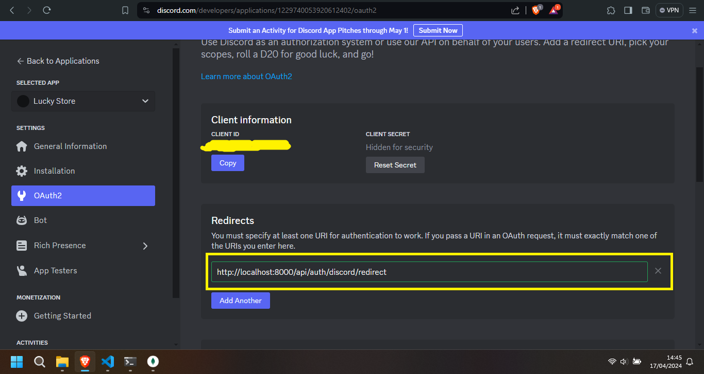

# Passport JS Express

A brief description of what the project does.

## Table of Contents

- [Installation](#installation)
- [Usage](#usage)
- [Contributing](#contributing)
- [License](#license)

## Installation

Instructions on how to install and set up the project.

## Usage

Instructions on how to use the project and any relevant examples.

### 1. For Discord Authentication, please see the documentation <a href="https://discord.com/developers/applications">here</a>, and follow the instructions

- See your port running, by the default 5000
- Add Callback URL to Discord Authentication
- Change redirect to **/src/strategies/passport-discord.js**

## Contributing

Guidelines on how to contribute to the project.

## License

Information about the project's license.
